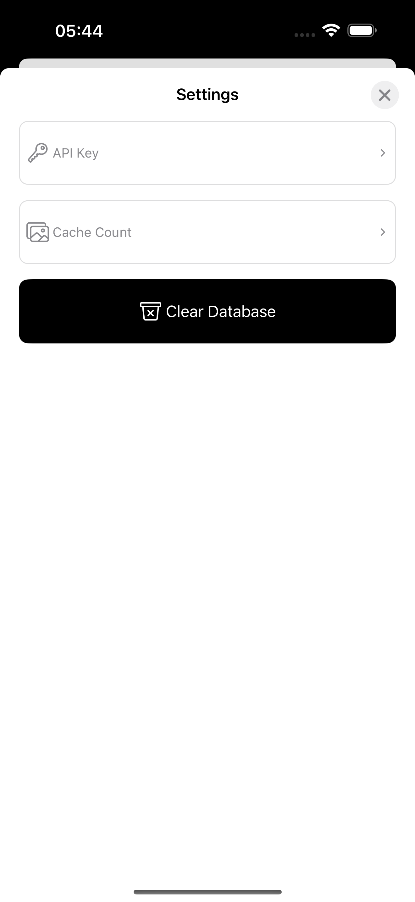
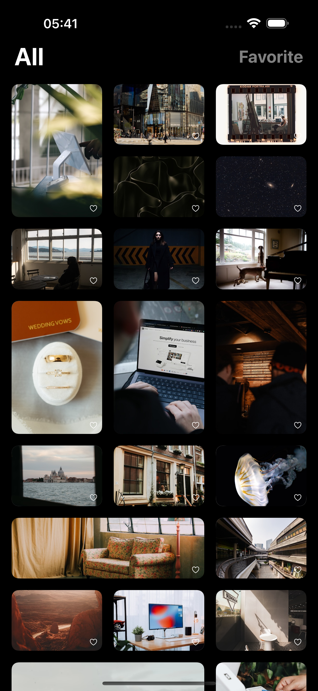

# Gallery

## Contacts

**Telegram:** [@hurynovichAndrej](https://t.me/hurynovichAndrej)

**Email:** [hurynovicandrej@icloud.com](mailto\:hurynovicandrej@icloud.com)

## Introduction

**Gallery** is a test project demonstrating the use of iOS system APIs. It is built with **Swift** and **UIKit** using programmatic layout and **CoreData** for data persistence. The app fetches images from the network, caches them, and allows users to add them to favorites, storing them in persistence. The architecture follows **MVVM+C**. Notable features include a custom **UICollectionViewCompositionalLayout** with a **random layout** and a smooth navigation title transition in **MultiPageViewController**.

## Screenshots & Videos

- [**Demo video**](https://youtu.be/dIFLi6TVTv8)
- [**Persistence test video**](https://youtube.com/shorts/_aptS5MLGsM)

|  |  |  | 
|:---:|:---:|:---:|
|MultiPage Title Transition|PostDetail Transition|Settings|

### Random CollectionView Compositional layout
|  |  |  | 
|:---:|:---:|:---:|
|iPad 13''|iPhone 16 Pro Max|Rotation|

## Assumptions

### 1. Tech Stack

**Technologies Used:**

- Swift
- UIKit (programmatic layout)
- CoreData
- URLSession
- Keychain
- UserDefaults
- NSCache

1. **Programmatic layout** was chosen for maintainability and flexibility. It simplifies version control, reduces merge conflicts, improves code readability.
2. **CoreData** and **URLSession** were prioritized to evaluate the understanding of system APIs rather than relying on external libraries. Similarly, **SnapKit** was avoided to encourage a deeper understanding of constraint-based layout.
3. **NSCache** was selected as an optimized system solution despite its limitation of working only with classes. Since images are passed between the cache and views, there is no significant advantage to using value types.

### 2. Architecture

The project follows the **MVVM+C** architecture, which provides a good balance between simplicity and modularity for medium-sized projects.

#### Simplified Project Structure:

**1. Coordinators:**

- ApplicationCoordinator
- SettingsCoordinator

**2. Services:**

- **AlertService** – Displays alerts in any context with a queue mechanism.
- **DatabaseService** – Handles persistence operations using **CoreData**, implemented as an **actor** to ensure thread safety. All data modifications are performed on background NSManagedObjectContext.
- **DataService** – Connects ViewModel, ImageCacheService, NetworkService, and DatabaseService. Implements parts of the **Facade Pattern** and operates as an **actor**.
- **ImageCacheService** – Caches non-favorite images.
- **NetworkService** – Manages API requests, enforces `reloadIgnoringCacheData` policy to highlight **ImageCacheService** functionality.

**3. Models:**

- Post
- PersistentPost

**4. ViewModels:**

- PostsMultiPageViewModel
- PostsListViewModel
- SettingsViewModel

**5. Views:**

- MultiPageView
- PostsMultiPageView
- PostsListView
- ReusablePagesView
- PostDetailPagesView
- PostDetailView
- SettingsView
- TextSetting

### 3. Database

CoreData was chosen as the **Apple-way** persistence solution. The project defines two types of post data: **PersistentPost** and **Post** (both conforming to `PostProtocol`).

Using a single **PersistentPost** class with different **NSManagedObjectContext** instances for regular and favorite posts would introduce unnecessary.

A more **efficient** solution is to convert posts between **PersistentPost** and **Post**. Since views work with `PostProtocol`, this approach remains transparent to the UI layer. **Post** remains a class (not a struct) because it is frequently passed between objects and stored in different locations.

### 4. Dependency Injection

**ServiceLocator** was chosen for dependency management. Some services, such as **AlertService**, are required across multiple components. Using a dependency injection container eliminates the need for deep dependency chains in initializers.

- Service instances are **lazy-loaded** (created on first access) and cached.
- All services are accessed through **protocols**, making them easy to replace with mocks during testing.

## Additional Features Implemented

### 1. **Custom Random UICollectionViewCompositionalLayout** (Without Repeating Patterns)

- Generates a random layout dynamically.
- Recalculates sections on device rotation while caching previous layouts for performance.

### 2. **ReusablePagesViewController**

- Implements a **reusable view controller pool**, similar to `UICollectionView`.
- Optimizes resource usage by reusing view controllers instead of creating new ones.

### 3. **Navigation Title Transition**

- Smoothly updates the navigation title as pages are swiped.

### 4. **API Key Storage in Keychain**

- Uses a simple custom wrapper for secure storage and retrieval.

### 5. **Image Cache Service**

- Caches non-favorite images in the largest loaded size.
- Cache limit is configurable in **Settings**.

### 6. **Save Images to Photo Library**

### 7. **Multiple API Endpoints**

- Uses different endpoints for:
  - Fetching images
  - Fetching post details (views, downloads, likes)
- **Adaptive image loading:** smaller images for thumbnails, high-quality images for detail view.

### 8. **Placeholder Colors for Unloaded Images**

- Before an image is fully loaded, its placeholder is displayed in its dominant color.

## Key Functionalities

- Browse posts
- View additional post details
- Add posts to favorites
- Automatically load higher-quality images when resizing screen
- Offline access to favorite images
- Change API key
- Adjust max cached images
- Clear the database in one tap
- Custom error handling for:
  - **API Key Not Found**
  - **Incorrect API Key**
  - **Rate Limit Exceeded**
  - **No Connection**

## Configuration

### API Key Setup

To use this application, you need an **Unsplash API key**:

1. Register on [Unsplash Developers](https://unsplash.com/developers).
2. Create a new application in the **Developer Dashboard**.
3. Copy your **Access Key**.
4. Enter the key in the **Settings** screen within the app.

### SwiftLint

If **SwiftLint** is not installed, you can either:

- Install it via [this guide](https://github.com/realm/SwiftLint)
- Remove it from **Target Build Phases**:
  1. Open Xcode and select the project.
  2. Navigate to **Build Phases**.
  3. Locate the **Run Script** phase containing `swiftlint`.
  4. Delete or comment out the script.

### Minimum iOS Version

- **iOS 13.0** or later required.
